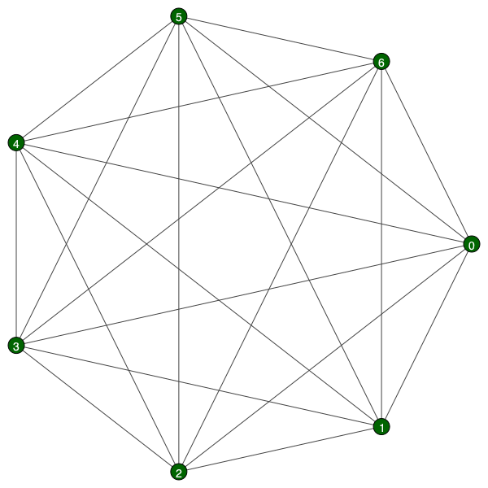
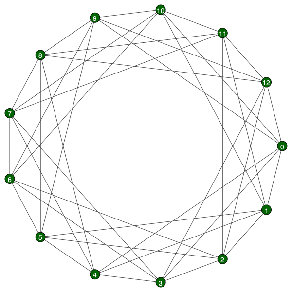
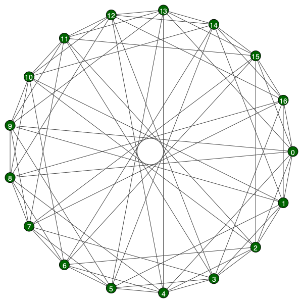
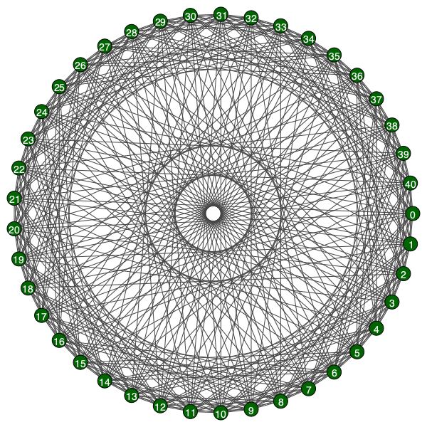

# soc-networks-hw
There is a py-module which allows make graphs; either images or export files via description of "circulates",
"fulls" or "Paley".

[lib.py](lib.py): contains two base classes to generate and export files in format you like

[main.py](main.py): check this file to parametrise generating and test system for correct functionality.

For now program is able to create _.png_ & _.pdf_ & etc files to image graphs and to export files in _.gml_, _.xml_
and _.txt_ formats.

## Examples:
_Full graph with 7 nodes:_\
\
_Circulant graph with 13 nodes:_\
\
_Paley's graph with 17 nodes:_\
\
_Paley's graph with 41 nodes:_\
\

